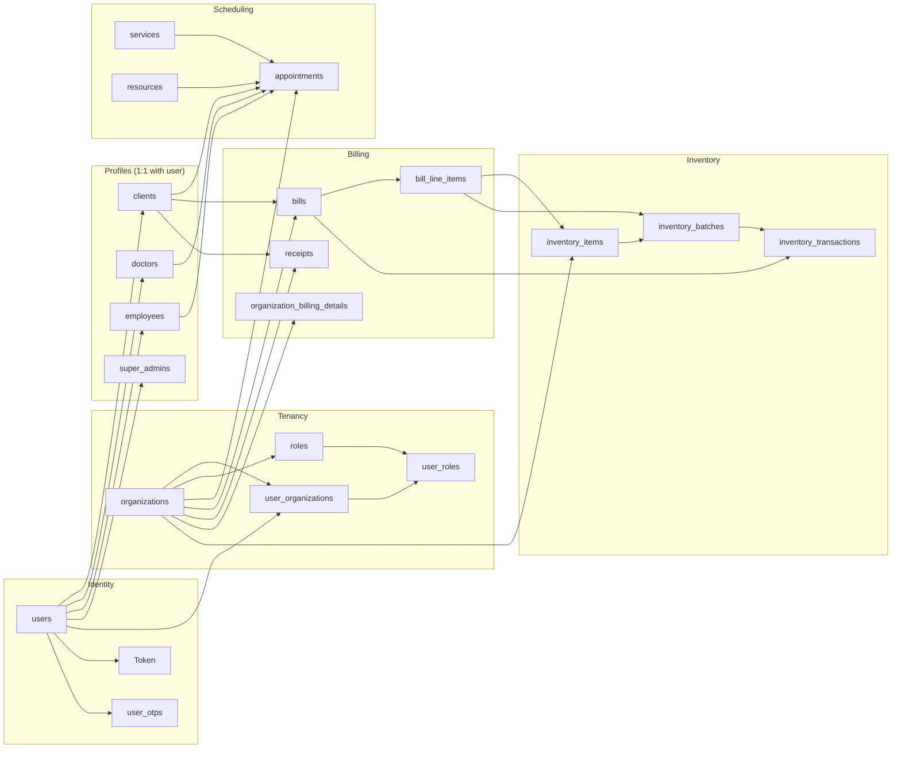
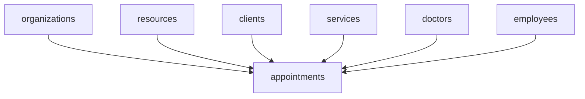
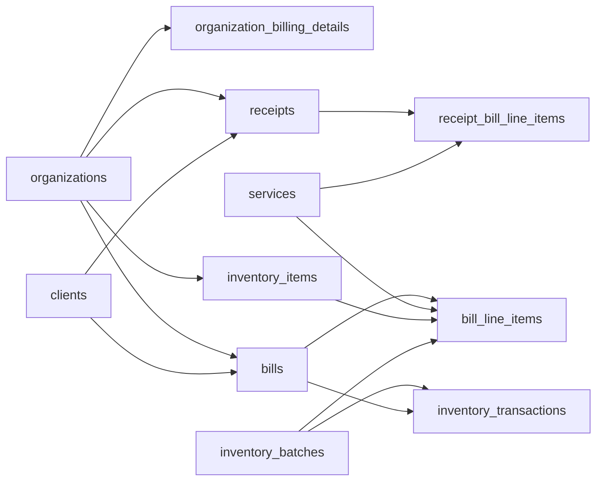

# Clinic appointment portal — data model and flows

This document describes how entities in [`schema.prisma`](./schema.prisma) relate to each other and how data typically flows through the system. The database is PostgreSQL (`public` schema).

---

## 1. High-level picture

The model splits into: **identity & access**, **tenancy (organizations)**, **people profiles**, **scheduling**, **client–organization links**, **billing** (including mixed service + inventory line items), **inventory** (SKU, batches, stock ledger), and **supporting systems** (notifications, reminders, OTP, jobs).

---

## 2. Identity and authentication

| Entity | Role in the flow |
|--------|------------------|
| **users** | Canonical login record: email, password hash, optional `login_id`, profile fields. Parent for all person-specific tables. |
| **clients**, **doctors**, **employees**, **super_admins** | Optional 1:1 extensions of `users` via `userid` / `user_id`. A given user typically matches at most one of these profile types in practice. |
| **Token** | Stores issued tokens keyed by `userId` (session/API token persistence). |
| **user_otps** | OTP lifecycle: hashed value, expiry, used flag; cascades when the user is deleted. |

**Flow:** A person registers or is provisioned as a **user** → the app attaches the correct **profile** row (`clients`, `doctors`, etc.) → **Token** / **user_otps** support login and verification.

---

## 3. Organizations and membership

| Entity | Role |
|--------|------|
| **organizations** | Tenant root: branding, GST, invoice prefix/sequence, billing contacts, etc. |
| **organization_applications** | Standalone intake for new org requests (`ApplicationStatus`, `trackingid`); not formally FK-linked to `organizations` in this schema. |
| **user_organizations** | Many-to-many: which users belong to which organization (`is_valid`). |
| **roles** | Per-organization role definitions; `(organization_id, name)` is unique. Cascade delete from organization. |
| **user_roles** | Assigns a **role** to a **user_organizations** membership row. |

**Flow:** An **organization** is created (or comes from an approved process) → **users** are linked via **user_organizations** → **roles** are defined per org → **user_roles** grants each member their role(s) in that org.

---

## 4. Access control (tabs and features)

| Entity | Role |
|--------|------|
| **tabs** | UI sections: `tab_unique_name`, path, ordering. |
| **tabs_role_table** | Links a **tab** to a **role** (enable/disable style via `is_valid`). |
| **feature** | Sub-features under a tab (`feature_unique_name`). |
| **feature_tab_role** | Fine-grained permission: which **feature** is allowed for which **tabs_role_table** row. Unique `(feature_id, tab_role_id)`. |

**Flow:** Define **tabs** and **features** → for each org **role**, **tabs_role_table** declares tab access → **feature_tab_role** narrows which features are on for that tab–role pair. Effective permissions are resolved in the application by joining role → user_roles → user_organizations.

---

## 5. Organization-scoped operational data

These entities hang off **organizations** and feed **appointments** and billing.

| Entity | Role |
|--------|------|
| **doctors** / **employees** | Staff linked to `users` and an `organization_id`; `portalid` is unique per row. |
| **resources** | Bookable assets (rooms, equipment); `status` uses `resource_status`. |
| **services** | Billable offerings: price, tax, `portal_id`, `services_status_enum`. |
| **categories** | Client segmentation/tags per org; unique `(organization_id, category_name)`. |

**Flow:** Org admin maintains **doctors**, **employees**, **resources**, **services**, and **categories** → these IDs are referenced when booking and when generating line items.

---

## 6. Clients and organization context

| Entity | Role |
|--------|------|
| **clients** | Patient/customer profile linked 1:1 to **users** (`userid`). Holds demographics and contact info. |
| **client_organization_category** | Junction: one row per `(client, organization)` with optional **category**; tracks `booked_status`, `portal_id`. Uniqueness constraints tie client–org and org–portal combinations. |

**Flow:** A **user** becomes a **client** → for each org they interact with, **client_organization_category** records category assignment and booking state (`booked_status`: `BOOKED` / `UNBOOKED`).

---

## 7. Appointments (core scheduling flow)

**appointments** ties together:

- **organizations** (required)
- **resources** (required)
- **clients** (optional)
- **services** (optional)
- **doctors** (optional)
- **employees** (optional)

It stores `portal_id`, time window (`date_time`, `start_time`, `end_time`), **appointment_status** (`BOOKED` → … → `CLOSED` / `CANCELLED`), and cancellation fields.

**Typical flow:** Organization and **resource** (and often **service**) are chosen → optional **client**, **doctor**, **employee** → slot is stored → status transitions until visit completion or cancellation.

---

## 8. Reminders

**reminder** links **organizations** + **clients** with a date, comments, completion remarks, and **reminder_status** (`checked` / `unchecked`). Used for follow-ups outside the strict appointment row.

---

## 9. Billing and payments

| Entity | Role |
|--------|------|
| **organization_billing_details** | 1:1 with **organizations**: GST, branding, invoice sequence for the billing module; `is_approved` uses **bill_module_status**. |
| **bills** | Invoice or quotation per org + client: totals, taxes, discounts, `bill_type_enum` (`INVOICE` / `QUOTATION`). Unique `(organization_id, invoice_number)`. |
| **bill_line_items** | Ordered lines (`line_position`) on a bill. Each row has **bill_line_kind**: `SERVICE` (links **services** via `service_id`) or `INVENTORY` (links **inventory_items** / **inventory_batches** for batch-wise GST traceability). Mixed service + product lines share one list. Cascades with **bills**. |
| **receipts** | Payments received: `receipt_id`, **client**, **organization_id**, amount. |
| **receipt_bill_line_items** | Line-level detail on a receipt referencing **services** only (unchanged). |

**Flow:** Invoice path: **organization_billing_details** informs numbering/letterhead → **bills** + **bill_line_items** may reference **services** and/or **inventory** batches. For **`bill_type` = `INVOICE`**, inventory lines trigger **stock out**: `inventory_batches.quantity_on_hand` is reduced and an **inventory_transactions** row (`STOCK_OUT`, `source_bill_id`) is created. **Quotations** store the same line shape but do **not** move stock until converted to an invoice. Payment path: **receipts** (+ optional **receipt_bill_line_items**) record money received against **clients** (and org).

**HTTP (client admin, JWT):** Base path `/api/v1/clientadmin/invoices`.

| Method | Path | Purpose |
|--------|------|---------|
| POST | `/create` | Create **INVOICE**; `line_items` may mix SERVICE + INVENTORY; stock deducted for INVENTORY lines when `bill_type` is INVOICE. |
| POST | `/quotation/create` | Create or update **QUOTATION**; same `line_items` shape; no stock movement. |
| POST | `/saveAsInvoices` | Convert quotation → invoice; copies inventory fields on lines then runs stock deduction for the new invoice. |
| GET | `/getBills` | List bills (query filters). |
| GET | `/billDetail/:id` | Single bill with **bill_line_items** ordered by `line_position`, then `created_at`. |

**PDF (mounted on `/api/v1/` directly, not under `/clientadmin`; see `src/routes/index.js`):** `GET /invoice/:billId`, `GET /invoice2/:billId` — full URLs `/api/v1/invoice/:billId`, `/api/v1/invoice2/:billId`; **bill_line_items** use the same ordering as the bill-detail API.

---

## 10. Inventory management (schema + HTTP APIs)

Stock is **per batch** under each SKU (**inventory_items** → many **inventory_batches**). Movements are recorded in **inventory_transactions** (`STOCK_IN`, `STOCK_OUT`, `ADJUSTMENT`); invoice-driven sales link a `STOCK_OUT` to **bills** via `source_bill_id`.

| Entity | Role |
|--------|------|
| **inventory_items** | Product/SKU master per **organizations**; optional unique `(organization_id, sku)`. |
| **inventory_batches** | Lot/batch: `batch_number`, `expiry_date`, `quantity_on_hand`; unique per item `(inventory_item_id, batch_number)`. |
| **inventory_transactions** | Ledger row: deltas, before/after quantities; **bills** optional source for invoice stock-outs. |

**HTTP (client admin, JWT):** Base path `/api/v1/clientadmin/inventoryManagement`.

| Method | Path | Purpose |
|--------|------|---------|
| POST | `/createItem` | Create SKU; optional first batch when initial stock & batch number provided. |
| GET | `/getBatches` | List batches for one SKU (billing / picker UI). |
| POST | `/addBatchStock` | New batch/lot with initial quantity. |
| GET | `/getItems` | Paginated SKU list with batch summary. |
| GET | `/getItemById` | One SKU with batches and totals. |
| GET | `/getItemFullDetails` | Audit: SKU, batches, transactions, bills referencing the SKU. |
| PUT | `/updateItem` | Update SKU master fields (not batch quantities). |
| POST | `/deleteItem` | Soft-delete SKU (and batches). |
| POST | `/adjustStock` | Manual IN / OUT / adjustment on a batch. |
| GET | `/getTransactions` | Paginated ledger (optional `itemId`, `batchId` filters). |

For request/response field detail, see [`docs/inventory-management-api.txt`](../docs/inventory-management-api.txt).

---

## 11. Notifications

**notifications** is a catalog of notification types. **notifications_organizations** toggles each type per **organizations** (`is_active`); unique `(notification_id, organization_id)`.

---

## 12. Miscellaneous

| Entity | Role |
|--------|------|
| **scheduler_job_dtl** | Operational/job metadata (`sno`, `run_datetime` string). |

---

## 13. Enum quick reference

| Enum | Values / purpose |
|------|------------------|
| **ApplicationStatus** | `PENDING`, `APPROVED`, `REJECTED` |
| **gender** | `Male`, `Female`, `Other` |
| **resource_status** | `ENABLED`, `DISABLED` |
| **appointment_status** | `BOOKED`, `CONFIRMED`, `VISITED`, `NO_SHOW`, `CANCELLED`, `CLOSED` |
| **categories_status_enum** | `ENABLED`, `DISABLED` |
| **services_status_enum** | `ENABLED`, `DISABLED` |
| **reminder_status** | `checked`, `unchecked` |
| **booked_status** | `BOOKED`, `UNBOOKED` |
| **bill_type_enum** | `INVOICE`, `QUOTATION` |
| **bill_line_kind** | `SERVICE`, `INVENTORY` |
| **inventory_transaction_type** | `STOCK_IN`, `STOCK_OUT`, `ADJUSTMENT` |
| **bill_module_status** | `APPROVED`, `PENDING`, `REJECTED` |

---

## 14. Relationship summary (by hub)

- **users** → at most one of `clients`, `doctors`, `employees`, `super_admins`; many `user_organizations`; many `user_otps`; many `Token` rows (by `userId`).
- **organizations** → `user_organizations`, `roles`, `doctors`, `employees`, `resources`, `services`, `categories`, `appointments`, `bills`, `receipts`, `reminder`, `notifications_organizations`, `client_organization_category`, optional `organization_billing_details`, `inventory_items` (and nested batches/transactions).
- **clients** → `appointments`, `bills`, `receipts`, `reminder`, `client_organization_category`.
- **bills** → `bill_line_items` (service and/or inventory lines), optional `inventory_transactions` as source for stock-outs.

This file is derived from `schema.prisma` and should be updated when the schema changes.
